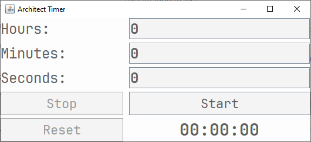

# CountDown timer

## Description
Application is an analog of default Windows Timer in [Clock](https://en.wikipedia.org/wiki/Windows_Clock) application.
Program sets timer and when the time is up, sends notification to user.

### Design
Notification:  

 
Application  

### Technologies
Principles & Patterns:
* SPR
* DRY
* KISS
* Visitor

Java Technologies:
* JFrame
* Swing
* Timer
* TimerTask
* SystemTray
### Features that will implemented in the future
1. Cover everything with tests.
2. Make handsome design.
3. Disallow resizing.
4. Figure out what to do with errors.

## How to Install and Run the Timer
1. Go to releases
2. Pick the latest version
3. Scroll down to Assets
4. Click on .exe file
5. Wait until downloading is done
6. Run app

## How to use Project
It is very simple!
1. Set hours/minutes/seconds
2. Click Start button

You can also click stop button to pause it or reset to *reset*.
When the time is up, you see the notification (if your system supports system tray). 
Note: 
1. If some error happened, you won't see it!
2. When timer started, inputs are disabled likewise some buttons